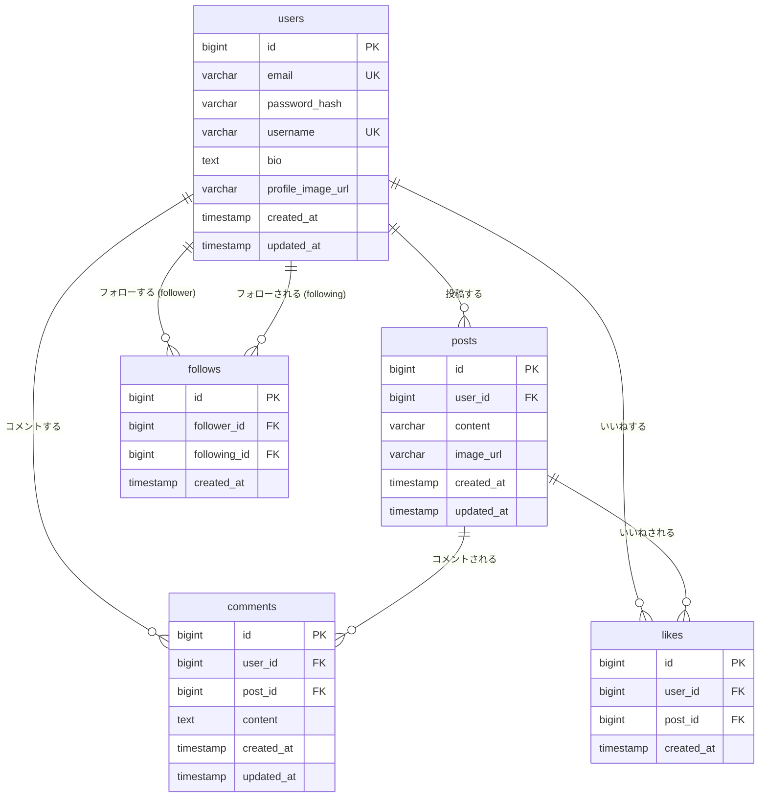

# Hitokuchi DB設計書

関連ドキュメント：[要件定義](./requirements.md) | [機能一覧](./features.md)

---

## 概要

PostgreSQL 17 を使用します。全テーブルの主キーは `id`（BIGSERIAL）とし、作成日時には `created_at`、更新日時には `updated_at` を持たせます。

---

## テーブル一覧

| テーブル名 | 概要 |
|---|---|
| users | ユーザー情報 |
| posts | 投稿 |
| comments | コメント |
| likes | いいね |
| follows | フォロー関係 |

---

## テーブル定義

### users

ユーザー情報を管理するテーブル。

| カラム名 | 型 | NOT NULL | 制約 | 説明 |
|---|---|---|---|---|
| id | BIGSERIAL | ○ | PK | 主キー |
| email | VARCHAR(255) | ○ | UNIQUE | メールアドレス |
| password_hash | VARCHAR(255) | ○ | | bcrypt ハッシュ化済みパスワード |
| username | VARCHAR(50) | ○ | UNIQUE | ユーザー名（表示名） |
| bio | VARCHAR(160) | | | 自己紹介テキスト（160 文字以内） |
| profile_image_url | VARCHAR(500) | | | アイコン画像の S3 URL |
| created_at | TIMESTAMP | ○ | DEFAULT NOW() | 作成日時 |
| updated_at | TIMESTAMP | ○ | DEFAULT NOW() | 更新日時 |

---

### posts

投稿を管理するテーブル。削除は物理削除とし、関連する comments・likes は ON DELETE CASCADE で一括削除する。

| カラム名 | 型 | NOT NULL | 制約 | 説明 |
|---|---|---|---|---|
| id | BIGSERIAL | ○ | PK | 主キー |
| user_id | BIGINT | ○ | FK → users.id | 投稿ユーザー |
| content | VARCHAR(280) | ○ | | 投稿テキスト（280 文字以内） |
| image_url | VARCHAR(500) | | | 添付画像の S3 URL |
| created_at | TIMESTAMP | ○ | DEFAULT NOW() | 作成日時 |
| updated_at | TIMESTAMP | ○ | DEFAULT NOW() | 更新日時 |

---

### comments

コメントを管理するテーブル。post_id には ON DELETE CASCADE を設定し、投稿削除時にコメントも一括削除する。

| カラム名 | 型 | NOT NULL | 制約 | 説明 |
|---|---|---|---|---|
| id | BIGSERIAL | ○ | PK | 主キー |
| user_id | BIGINT | ○ | FK → users.id | コメントユーザー |
| post_id | BIGINT | ○ | FK → posts.id ON DELETE CASCADE | 対象投稿 |
| content | VARCHAR(280) | ○ | | コメントテキスト（280 文字以内） |
| created_at | TIMESTAMP | ○ | DEFAULT NOW() | 作成日時 |
| updated_at | TIMESTAMP | ○ | DEFAULT NOW() | 更新日時 |

---

### likes

いいねを管理するテーブル。同一ユーザーが同一投稿に複数回いいねすることを禁止するため複合 UNIQUE 制約を持つ。post_id には ON DELETE CASCADE を設定し、投稿削除時にいいねも一括削除する。

| カラム名 | 型 | NOT NULL | 制約 | 説明 |
|---|---|---|---|---|
| id | BIGSERIAL | ○ | PK | 主キー |
| user_id | BIGINT | ○ | FK → users.id | いいねしたユーザー |
| post_id | BIGINT | ○ | FK → posts.id ON DELETE CASCADE | いいねした投稿 |
| created_at | TIMESTAMP | ○ | DEFAULT NOW() | 作成日時 |

- 複合 UNIQUE 制約：`(user_id, post_id)`

---

### follows

フォロー関係を管理するテーブル。同一ユーザーが同一ユーザーを複数回フォローすることを禁止するため複合 UNIQUE 制約を持つ。

| カラム名 | 型 | NOT NULL | 制約 | 説明 |
|---|---|---|---|---|
| id | BIGSERIAL | ○ | PK | 主キー |
| follower_id | BIGINT | ○ | FK → users.id | フォローするユーザー |
| following_id | BIGINT | ○ | FK → users.id | フォローされるユーザー |
| created_at | TIMESTAMP | ○ | DEFAULT NOW() | 作成日時 |

- 複合 UNIQUE 制約：`(follower_id, following_id)`

---

## ER図

---

## インデックス設計

| テーブル | インデックス対象カラム | 目的 |
|---|---|---|
| posts | user_id | プロフィール画面での投稿一覧取得 |
| posts | created_at | タイムラインの新着順ソート |
| comments | post_id | 投稿詳細でのコメント一覧取得 |
| likes | post_id | 投稿ごとのいいね数集計 |
| likes | (user_id, post_id) | いいね済み確認（UNIQUE 制約兼用） |
| follows | follower_id | フォロー中一覧取得 |
| follows | following_id | フォロワー一覧取得 |
| follows | (follower_id, following_id) | フォロー済み確認（UNIQUE 制約兼用） |
